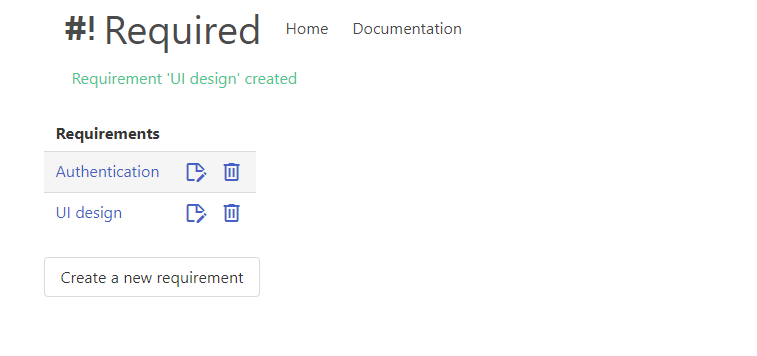
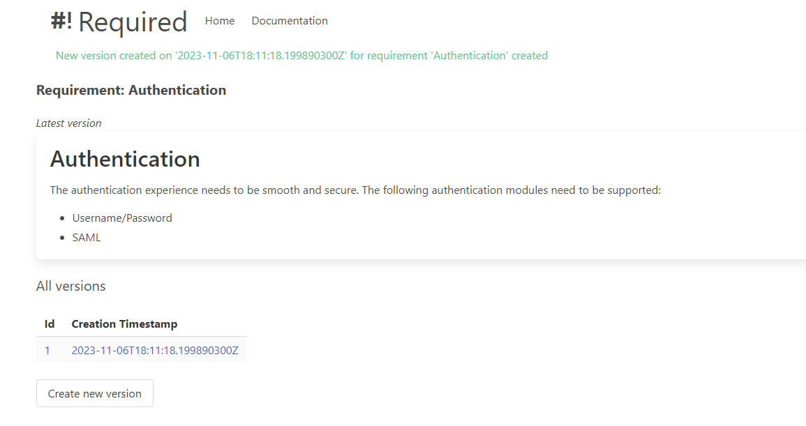
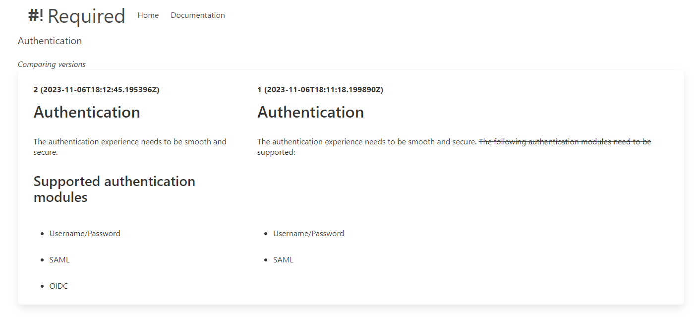

# Required
A lightweight webapp to store and track requirements for a project.

## Features

### Requirement management
'Required' allows you to create, update or delete requirements for a project.

*Requirements overview page where you can add, update and delete requirements*

### Requirement version management
For every requirement it is possible to see what the latest version looks like and of course improve them! 
The requirement versions can be drafted in markdown, making it possible to style the requirements in an easy and reusable way.

*See the latest version of a requirement and create new versions*

### Version comparing
Versions can be compared side-by-side in a 'git fashion'.

*Comparing different versions is made easy*

## Configuration
It is possible to run the webapp with a file-based database or with a mysql database.

| Variable | Description | Default value |
|---|---|---|
| DATASOURCE_URL | Datasource configuration string | jdbc:h2:file:~/required.db |
| DB_USER | Database user | sa |
| DB_PASSWORD | Database user password | |
| DB_DRIVER | Database driver class | org.h2.Driver |
*Variables available for configuration*

## Features to implement
- Write how-to documentation page
- Authz and user management
- Docker-compose example